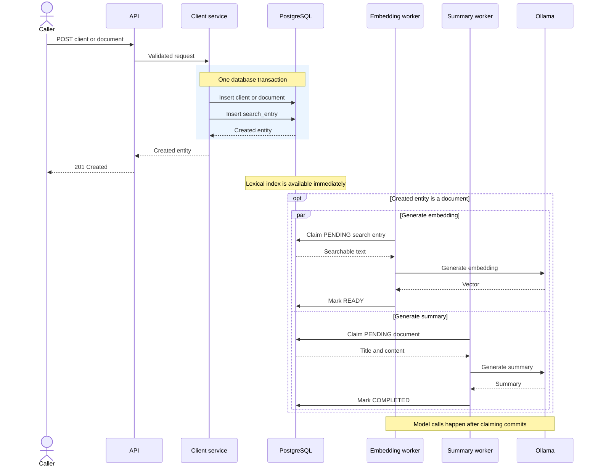
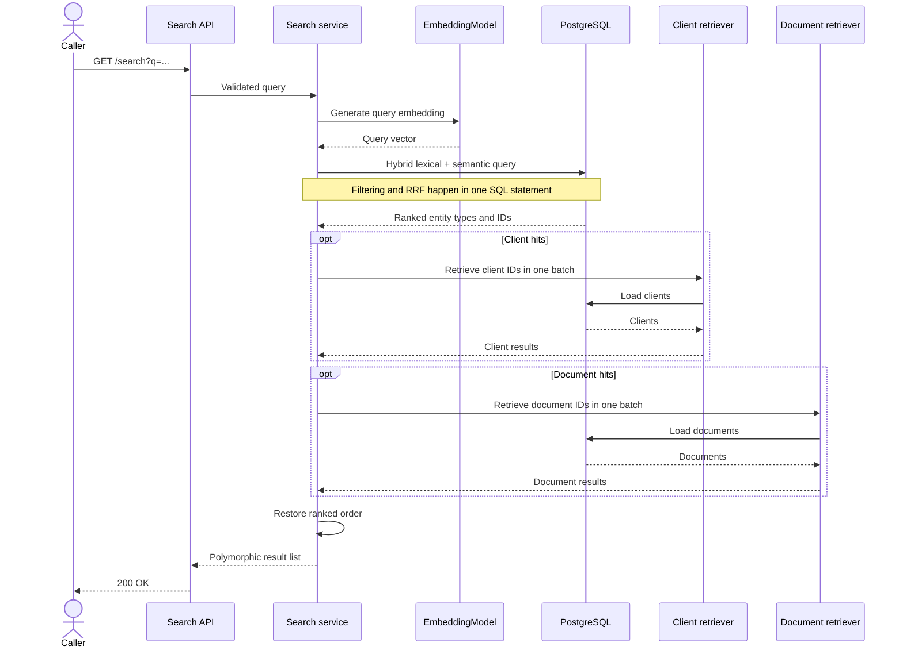

# Nevis Docs

An API for storing clients and their documents, then searching both through one ranked endpoint. It combines PostgreSQL full-text search with pgvector, and uses local Ollama models for document embeddings and summaries.

## Prerequisites

- Java 25
- Docker and Docker Compose
- Port 8080 available, if you intend to start the application

Docker is required both to run the service and to execute the integration tests.

## Running

```bash
./mvnw spring-boot:run
```

That is the whole setup. `spring-boot-docker-compose` brings up `compose.yaml`, and Flyway applies the schema during startup, so nothing has to be created by hand.

Compose starts:

- PostgreSQL using `pgvector/pgvector:pg18`
- Ollama
- A one-shot model-pull service

The model-pull service downloads:

- `mxbai-embed-large` for document embeddings
- `llama3.2:3b` for summaries

The models occupy approximately 2.7 GB together. A first run therefore takes longer, but the `ollama-models` volume preserves them across restarts.

To follow the initial download:

```bash
docker compose logs -f ollama-model-pull
```

The service exits with code `0` once both models are present. Running it again is a no-op.

Compose owns model downloads; the application does not try to pull models while the Spring context is starting.

### Trying it out

Ready-to-run requests for the IntelliJ HTTP Client are available in:

```text
http/clients.http
http/search.http
```

To create a representative dataset through the API:

```bash
python3 load-sample-data.py
```

The script uses only the Python standard library. It creates six clients and fifteen documents and prints their IDs. It defaults to `http://localhost:8080`.

### Running the pieces separately

Nothing requires Spring to manage the Compose lifecycle:

```bash
docker compose up -d

./mvnw spring-boot:run \
  -Dspring-boot.run.arguments=--spring.docker.compose.lifecycle-management=none
```

Spring then leaves the containers running but still derives the datasource and Ollama connection details from `compose.yaml`.

If Compose integration is disabled entirely with:

```text
spring.docker.compose.enabled=false
```

both the datasource properties and `spring.ai.ollama.base-url` must be supplied explicitly.

## Tests

Run the complete default suite with:

```bash
./mvnw clean verify
```

The integration tests use PostgreSQL through Testcontainers, so Docker is required.

The default suite does not require:

- A running Ollama instance
- Downloaded local models
- External API credentials

The background workers are disabled where scheduling would make tests nondeterministic. `EmbeddingModel` and `ChatModel` are replaced with deterministic test implementations where embeddings or summaries are needed.

`LivePipelineIntegrationTest` exercises the complete pipeline against real local models. It is `@Disabled` by default because it is slow, hardware-dependent and requires both Ollama models.

## API

| Method | Path | Purpose |
| --- | --- | --- |
| `POST` | `/clients` | Create a client |
| `POST` | `/clients/{clientId}/documents` | Create a document for a client |
| `GET` | `/search?q={query}` | Search clients and documents together |

The generated OpenAPI document is served at:

<http://localhost:8080/v3/api-docs>

Swagger UI is available at:

<http://localhost:8080/swagger-ui/index.html>

Request and response bodies use `snake_case`.

Create responses return `201 Created` with a `Location` header.

| Status | Meaning |
| --- | --- |
| `400` | Invalid request or search query |
| `404` | Client does not exist |
| `409` | Email address already belongs to a client |
| `503` | Query embedding model is unavailable |

### Examples

#### Create a client

```bash
curl -s -X POST http://localhost:8080/clients \
  -H 'Content-Type: application/json' \
  -d '{
    "first_name": "Amelia",
    "last_name": "Okafor",
    "email": "amelia.okafor@neviswealth.com",
    "description": "Discretionary portfolio, ESG mandate",
    "social_links": [
      "https://linkedin.com/in/amelia-okafor"
    ]
  }'
```

The response is `201 Created` with a header such as:

```text
Location: /clients/194863f0-2b92-49db-8e0b-ab2a539f2aba
```

```json
{
  "id": "194863f0-2b92-49db-8e0b-ab2a539f2aba",
  "first_name": "Amelia",
  "last_name": "Okafor",
  "email": "amelia.okafor@neviswealth.com",
  "description": "Discretionary portfolio, ESG mandate",
  "social_links": [
    "https://linkedin.com/in/amelia-okafor"
  ]
}
```

#### Add a document

```bash
curl -s -X POST \
  http://localhost:8080/clients/194863f0-2b92-49db-8e0b-ab2a539f2aba/documents \
  -H 'Content-Type: application/json' \
  -d '{
    "title": "Driving licence",
    "content": "Photocard driving licence issued by DVLA. Holder Amelia Okafor. Valid until 2033."
  }'
```

The response comes back before summary generation:

```json
{
  "id": "510981bd-b31f-40e3-abd8-25d02883ddee",
  "client_id": "194863f0-2b92-49db-8e0b-ab2a539f2aba",
  "title": "Driving licence",
  "content": "Photocard driving licence issued by DVLA. Holder Amelia Okafor. Valid until 2033.",
  "created_at": "2026-09-01T19:53:33.467594Z",
  "summary": null,
  "summary_status": "PENDING"
}
```

#### Search by email domain

PostgreSQL search normalises email punctuation, so the domain can be matched independently from the complete address:

```bash
curl -s --get \
  --data-urlencode 'q=NevisWealth' \
  http://localhost:8080/search
```

```json
[
  {
    "type": "CLIENT",
    "id": "194863f0-2b92-49db-8e0b-ab2a539f2aba",
    "first_name": "Amelia",
    "last_name": "Okafor",
    "email": "amelia.okafor@neviswealth.com",
    "description": "Discretionary portfolio, ESG mandate",
    "social_links": [
      "https://linkedin.com/in/amelia-okafor"
    ]
  }
]
```

#### Search semantically

Neither `energy` nor `invoice` appears in the returned document:

```bash
curl -s --get \
  --data-urlencode 'q=energy invoice' \
  http://localhost:8080/search
```

```json
[
  {
    "type": "DOCUMENT",
    "id": "583130e5-5d13-448a-ab9e-cc0523a37d97",
    "client_id": "96789f26-1fb4-4577-9000-30b51ec6e355",
    "title": "Electricity statement",
    "content": "Utility bill for 10 Downing Street, London SW1A 2AA. Account 4471029. Billing period March 2026. Amount due GBP 184.20.",
    "created_at": "2026-09-01T19:34:07.666074Z",
    "summary": "A utility bill has been received for 10 Downing Street, London, with an amount of GBP 184.20 due for the billing period March 2026. The bill is for account number 4471029."
  }
]
```

Responses above are abbreviated to the relevant hit. The complete response is capped by `search.result-limit`.

A document’s `summary` remains `null` until the summary worker has processed it.

## Technology selection

The task splits into four concerns, each driving a choice:

| Concern | Choice | Why |
| --- | --- | --- |
| Store clients and their documents | PostgreSQL | The POST endpoints imply relational records with integrity constraints |
| Lexical search | PostgreSQL full-text search using `tsvector` and a GIN index | Tokenisation, normalisation and ranking are built in |
| Semantic search | pgvector with `mxbai-embed-large` | Vector similarity can stay in the same database |
| Summarisation | `llama3.2:3b` | This is the only part that needs generation rather than retrieval |

### Local models, not a hosted API

Both models run through Ollama rather than a hosted provider. No account or API key is needed, and document content stays local.

A fresh machine still needs network access for the initial model download. Once downloaded, both models are cached locally. The default test suite does not depend on either model.

The cost is quality and speed. `llama3.2:3b` is small, so its summaries are less capable than those from a frontier model. Local inference is also slow enough that making document creation wait for summary generation would be a poor API trade-off.

Swapping to a hosted provider would mostly be a configuration change because Spring AI exposes both models through `ChatModel` and `EmbeddingModel`.

It would not be entirely configuration-only: the embedding width is fixed in the schema as `vector(1024)`, so a model with different dimensions would require a migration and re-index.

### One database, not a database plus a search engine

A separate search engine would introduce a distributed write: the source database could commit while the search update failed.

Doing this safely would require an outbox or CDC stream and a consumer, making every form of indexing eventually consistent.

PostgreSQL already supports the relational data, full-text search and vector distance needed here. Keeping the projection in the same database means the source row and its lexical search entry can commit together.

The cost is shared capacity. Transactional and search workloads use the same PostgreSQL instance, and exact vector scans become more expensive as the number of indexed documents grows.

If independent scaling became necessary, the search projection could move into a dedicated system and be fed through an outbox or CDC. That would be a response to measured scale, not something required by this dataset.

## Decisions

Once the storage and model choices were made, the remaining decisions were mostly about service architecture and consistency: what has to happen during the request, and what can happen later.

### API shape

Search returns one array with a `type` discriminator rather than separate client and document collections. Separate arrays would be easier to produce, but they would avoid the main problem rather than solve it: if a query matches both a client and a document, they still need one meaningful order.

There is no pagination. The response is capped by `search.result-limit`, which is enough at this scale. A real collection endpoint would normally need pagination to avoid unbounded payloads and limit pressure on the service.

Both POST endpoints come from the task; I did not add additional read, update or delete routes.

I did make email addresses unique case-insensitively. Treating the same address as two separate clients would make both creation and search behaviour surprising. A duplicate email returns `409`.

Creates return a `Location` header, but they are not idempotent. Retrying a document POST creates another document. The header identifies the created resource, although the task does not define a GET endpoint for that URI.

Errors currently use HTTP status codes without a response body. That is enough for this exercise. A production API would return a consistent problem-details structure with a stable code, rather than asking clients to depend on status alone.

## Indexing

The source client and document tables remain the owners of entity data. Search uses a separate, deliberately small `search_entry` projection containing:

- Entity type and ID
- The text used for searching
- A generated lexical index
- An optional document embedding
- Embedding-processing state

It does not contain response payloads or document summaries. Search first decides *which* entities matched; the source tables are then used to build the response. This avoids duplicating complete entities in the index and removes another copy that could drift.

### One projection for both entity types

Clients and documents share one projection keyed by `(entity_type, entity_id)`. This gives search one table and one query plan instead of two result sets that would have to be ranked after the fact.

The trade-off is that `entity_id` is polymorphic, so PostgreSQL cannot attach a useful foreign key to it. There are no delete endpoints, which makes stale entries unlikely through the public API. Search still handles them defensively: if hydration cannot find the source entity, that hit is dropped and logged instead of failing the whole request.

### Write path



Client creation ends after the synchronous transaction. Documents follow the same write path, then independently acquire an embedding and summary in the background.

### What gets indexed

Client searchable text is built from:

```text
first name
last name
email
description
social links
```

Document searchable text is:

```text
title
content
```

The extraction stays in the `client` package, which understands those records. The search package receives only the resulting string.

For lexical search, PostgreSQL normalises punctuation before tokenising:

```sql
to_tsvector(
    'simple',
    regexp_replace(searchable_text, '[^[:alnum:]]+', ' ', 'g')
)
```

This is important for the example from the task. Without normalisation, PostgreSQL can treat an entire email address as one token, so `NevisWealth` would not match `john.doe@neviswealth.com`. Splitting punctuation gives it separate `john`, `doe`, `neviswealth` and `com` terms.

### Immediate lexical search, eventual semantic search

The source entity and its search entry are written in the same transaction. The lexical index is a generated PostgreSQL column, so a successful client or document POST is lexically searchable as soon as it commits.

Document embeddings are different. Generating one requires an external model call, and I did not want to hold a database transaction and connection open while Ollama runs. A new document therefore starts with a `PENDING` embedding and is picked up by a background worker.

That makes the consistency model explicit:

- Lexical search is immediate.
- Semantic search is eventually consistent.
- A document only joins semantic ranking after its embedding becomes `READY`.

Clients do not receive embeddings. They contain short, structured fields where lexical matching covers the intended cases; semantic search is more useful for document content. The schema can support client embeddings later if a real use case appears.

The embedding column has no approximate-nearest-neighbour index. Exact cosine distance is simpler and fast enough for this dataset. I would add HNSW only after the data volume and measured latency justify accepting approximate results.

## Summarisation

Summaries belong to documents, not to the search projection.

A document POST returns immediately with:

```text
summary = null
summary_status = PENDING
```

A background worker later moves it through:

```text
PENDING → PROCESSING → COMPLETED
                     ↘ FAILED
```

The worker claims rows atomically with `FOR UPDATE SKIP LOCKED`, commits the claim, and only then calls Ollama. No database transaction or row lock is held during inference.

Documents are processed sequentially. Both background workers share one local Ollama instance, and parallel calls would mostly compete for the same machine rather than improve useful throughput.

A completed summary is written back to the document row. Search sees it the next time that document is hydrated; completing a summary does not modify or rebuild the search entry.

The document creation response exposes `summary_status`. Search currently exposes only `summary`, so a null value there does not distinguish pending processing from failure. I accepted that for this API surface rather than adding another field only to describe an optional extension.

Failure reasons are authored values rather than raw exception messages. Model and HTTP exceptions may include unstable provider details or echoed document content, neither of which belongs in a durable database column or application log.

Long documents are truncated at `summary.max-input-characters`. A production implementation would split them by tokens, summarise the chunks and then reduce those summaries, but that was beyond the useful scope of this exercise.

## Background-worker guarantees

Embedding and summarisation use the same basic pattern:

1. Claim a batch of `PENDING` rows atomically.
2. Move them to `PROCESSING`.
3. Commit.
4. Call the model without an open transaction.
5. Store `READY`/`COMPLETED` or `FAILED` independently for each row.

This works across multiple healthy application instances because locked rows are skipped while claiming work.

It is intentionally single-attempt. There is no retry counter, lease, claim token or stale-claim recovery. If the process stops after committing `PROCESSING` but before the terminal update, that row remains stranded.

For production I would add a processing lease, reclaim stale work, retry transient failures with backoff, and use a claim token to prevent an old worker from completing work after it has been reassigned.

## Search

`GET /search` performs three steps:

1. Build an embedding for the query.
2. Rank entity IDs in one hybrid PostgreSQL query.
3. Hydrate the ranked IDs from the client and document tables.

The database query builds lexical and semantic candidate lists, then combines them with Reciprocal Rank Fusion.



### Why Reciprocal Rank Fusion

Lexical relevance from `ts_rank_cd` and semantic cosine distance are unrelated measures. Adding or averaging their raw values would give the appearance of a common scale without actually having one.

RRF avoids that by using position instead:

```text
1 / (rrf-k + lexical-rank)
+
1 / (rrf-k + semantic-rank)
```

A result receives zero for a candidate list it did not appear in. A document found both lexically and semantically receives both contributions.

This gives clients and documents one order without inventing a normalisation formula.

### Semantic relevance is filtered before fusion

Lexical search is naturally selective: a row either contains the query terms or it does not.

Vector search always has a nearest document, even when every document is irrelevant. Without a distance limit, every query would bring some semantic documents into fusion simply because they were the least distant available ones.

The distance filter must be applied before RRF. Once a candidate has been converted into a rank, the original similarity has been discarded: the top semantic result receives the same RRF contribution whether it is an excellent match or merely the least bad one.

`search.max-semantic-distance` is currently `0.5`. That value came from measuring the included sample queries rather than from a general rule. It is intentionally configurable because it is sensitive to the model, document length and actual data. In production I would calibrate it against a labelled set of queries and expected results.

The remaining search settings are configurable as well:

- `candidate-limit` controls how many lexical and semantic candidates enter fusion.
- `result-limit` caps the final response.
- `rrf-k` controls how much rank position influences the fused score.
- `max-semantic-distance` excludes weak semantic candidates.

### Hydrating results

The search projection returns only type, ID and score. It does not duplicate the source entity.

An `EntityType -> EntityRetriever` registry dispatches client and document IDs to their respective packages. Each retriever loads its IDs in one batch and creates the public result type. The search service then restores the order returned by SQL.

This means a mixed result requires one ranking query and up to two hydration queries, but relevance is calculated once, in one place. There is no separate client ranking and document ranking to reconcile in Java.

An alternative, especially for search powering a dashboard, would be to keep enough display data in the projection to return results directly. The complete entity would then be loaded only when the user navigates to it. That would remove the hydration queries, at the cost of duplicating payload fields in the projection and keeping them in sync with their source entities.

## Security

Authentication and authorisation are outside the exercise.

As written, any caller can create clients, attach documents to any known client ID and search the complete dataset. There is also no rate limiting, audit log or tenant boundary.

In a multi-tenant service, entitlement filtering must happen inside both candidate queries before fusion. Filtering the final fused list would distort ranking and return partially-filled result pages.

## Where I would take it next

The next changes would depend on which limit was reached first rather than on adding infrastructure speculatively:

1. **Worker reliability:** leases, retries, stale-work recovery and claim tokens.
2. **Search quality:** a labelled query set, threshold calibration and regression evaluation.
3. **Long documents:** chunked embeddings and hierarchical summaries.
4. **Search scale:** HNSW or, eventually, an external search projection fed through an outbox or CDC.
5. **API maturity:** pagination, idempotency and consistent problem-details responses.
6. **Security:** authentication, ownership checks, tenant-aware ranking and audit logging.
7. **Observability:** the service logs failures, but a production system would also expose model latency, queue depth and failure metrics, and use distributed tracing through OpenTelemetry.
